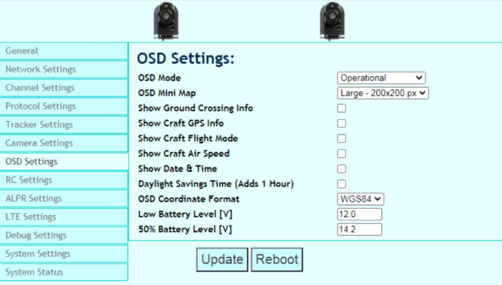

# Changing camera settings

## Introduction

The Nighthawk2 camera gimbal is controlled by a dedicated board computer called the TRIP. The TRIP board computer controls most features of the camera gimbal system.

## Logging in to the configuration website

To change the settings of your camera system, connect to your UAV with the DeltaQuad Controller. On the DeltaQuad Controller open the Firefox browser app, and navigate to http://192.168.144.201. This will open the login page to the TRIP camera board computer. The default username is 'admin' and the password is 'microcam'. You may change this as required.


_NOTE: changing settings other than those described in this manual can cause damage to your camera system._


## Roll Derotation

The camera is capable of keeping the video stream aligned with the horizon when the vehicle is banking. This is called Roll Derotation.

When roll derotation is active the video image displayed on the controller will rotate in such a way that the image remains level. The trade-off is that the video can show black corners when the vehicle is banking.

To enable or disable Roll Derotation select "Channel settings" and change the value of the checkbox next to "Enable Roll Derotation". After changing the values click on "UPDATE" at the bottom of the screen.

## On Screen Display

The video feed contains an On Screen Display (OSD). This means that the video feed receives an overlay with telemetry and status information. The OSD overlay is both visible in the video stream on the controller, and on the onboard recorded video.

To change the settings of the OSD select "OSD Settings" and select the options you wish to display. The OSD coordinate system can be changed from WGS84 LAT/LON to the military standard MGRS system.

