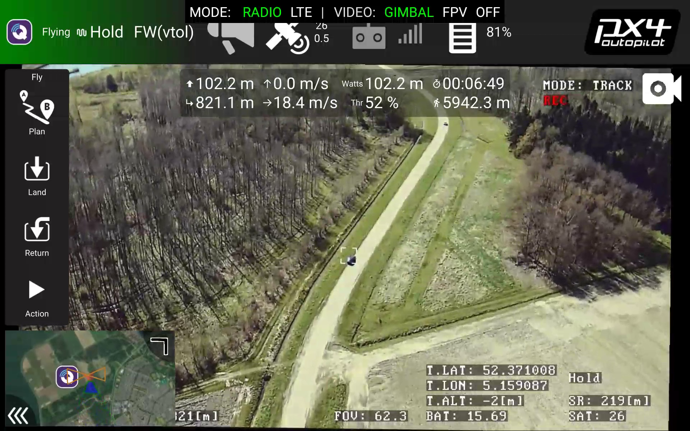

# Controlling the camera

## Deploying & Retracting the gimbal

The Deploy Gimbal button (8) on your controller is used to deploy and retract the gimbal. The button can be pressed once to deploy the gimbal when the vehicle is flying. The light around the button will light up indicating it has switched the mode to Deployed. If the vehicle is not flying the command will be ignored to prevent damage to the camera.

For ground testing purposes you can force deploy the gimbal. This is achieved by pressing and holding the deploy button. The light around the button will blink fast indicating the Force Deploy mode is active. Make sure you place the vehicle in such a way that the gimbal can safely deploy before using this function.

When the vehicle has transitioned into fixed-wing mode you may deploy the camera gimbal using the deploy gimbal button. It is recommended not to deploy the camera gimbal until the vehicle has passed its takeoff waypoint.&#x20;


_NOTE: Never deploy the camera gimbal while the vehicle is sitting on the ground. This may damage the camera gimbal._


## The FLY view

When the camera is deployed the video feed will be visible either in the main screen or in the small video screen in the bottom-left section of the FLY view. You can switch the main screen between the satellite map and video feed by tapping on the small screen in the bottom-left corner.

On the right side of the fly screen, the camera controls are displayed. These controls allow you to change the mode of the Nighthawk2 camera system. The controls can be hidden by pressing the arrow inside the circle above the controls window.

The camera controls window allows you to set the following camera modes:

* OBS: In this mode the camera will hold its position relative to the vehicles movement. The joystick controls the camera.
* GRR: In this mode the camera will hold its position relative to the ground. This is the recommended mode for camera control. The joystick controls the camera.
* STOW: In this mode the camera will point towards the nose of the vehicle. The joysticks are disabled in this mode.
* DAY: This activates the RGB (normal color video) mode of the camera
* THERMAL: This activates the Infrared camera for night vision and seeing between foliage.
* NUC: After engaging the THERMAL mode, the IR camera needs to calibrate for a clear view. NUC performs this calibration which takes about 3 seconds.
* Color.P: This activates the color palette mode for the thermal camera
* B/W.P: This activates the black and white palette mode for the thermal camera
* RETRACT: This retracts or deploys the camera gimbal. It is recommended to use the deploy button on the controller instead of this function.
* REC ON/OFF: This activates or deactivates onboard sd-card recording. This function only works when an sd-card is installed in the camera control computer which is located next to the camera.

## Using the DeltaQuad controller

The DeltaQuad Controller can be used to control the camera gimbal. For a full overview of the available joystick controls and switch functions, please read the [DeltaQuad Controller section](deltaquad-controller.md).

## On Screen Display

The video feed of the camera gimbal is equipped with On Screen Display (OSD) telemetry information. This information contains the following:

| Name  | Location      | Function                                                                                            |
| ----- | ------------- | --------------------------------------------------------------------------------------------------- |
| MODE  | Top right     | 
Current gimbal mode

TRACK: Actively tracking an object

For other modes see above
 |
| REC   | Top right     | Onboard recording active                                                                            |
| T.LAT | Bottom right  | Target latitude (can be set to MGRS)                                                                |
| T.LON | Bottom right  | Target longitude (can be set to MGRS)                                                               |
| T.ALT | Bottom right  | Target altitude MSL                                                                                 |
| SR    | Bottom right  | Slant Range (distance to target in meters)                                                          |
| SAT   | Bottom right  | Number of satellites                                                                                |
| FOV   | Bottom center | 
Field Of View

3.0 is fully zoomed in

62.3 is fully zoomed out
                    |
| D     | Bottom left   | Distance from home in meters                                                                        |

## Map integration

While the camera is deployed, the satellite map on the FLY screen will display the current Field Of View for the camera. The blue area in the map shows the current viewing area of the camera based on its position and zoom.

.png>)
